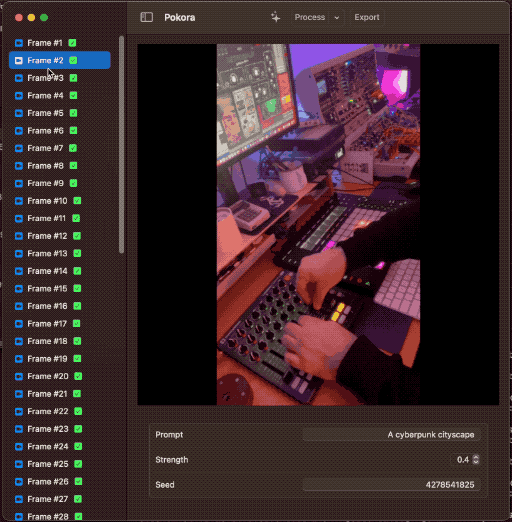

# Pokora

Pokora is a video editing and creation platform that combines existing video clips with AI generated video clips, using Stable Diffusion, with a native SwiftUI interface. Check out [ml-stable-diffusion](https://github.com/apple/ml-stable-diffusion) for the latest model changes and how to convert models.

🧙‍♂️ Pokora is named after Hans Pokora, author of many books on psychedelic music.

## Features

- Load video from disk ✅
- Process frames using Stable Diffusion (prompt, seed, strength) ✅
- Export video including audio from original video ✅
- Adjust strength over the course of the video [#7](https://github.com/pj4533/Pokora/issues/7)
- Playback video in app [#9](https://github.com/pj4533/Pokora/issues/9)
- Add up rezzing using RealESRGAN [#8](https://github.com/pj4533/Pokora/issues/8)
- Persist between launches [#16](https://github.com/pj4533/Pokora/issues/16)
- Update to use ControlNET [#10](https://github.com/pj4533/Pokora/issues/10)
- Show preview while processing [#34](https://github.com/pj4533/Pokora/issues/34)
- Multiselect [#36](https://github.com/pj4533/Pokora/issues/36)
- Need icon [#38](https://github.com/pj4533/Pokora/issues/38)
- Need easier install of models [#39](https://github.com/pj4533/Pokora/issues/39)

## Limitations

- Requires square video as input
- Requires models converted to CoreML
- Currently using [ml-stable-diffusion](https://github.com/apple/ml-stable-diffusion) v0.3.0
- Requires manual install of models into `model_output/Resources`

## Requirements

Built using below, but haven't tested elsewhere yet.

- macOS 13.3.1+
- Xcode 14.3+

## Installation

(FIGURE OUT)

## License

This project is licensed under the MIT License - see the [LICENSE](./LICENSE) file for details.

