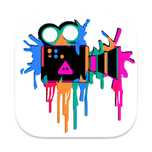

# Pokora

  

Pokora is a video creation platform that combines existing video clips with AI generated video clips, using Stable Diffusion, in a native SwiftUI interface, completely local with no internet access necessary. Pokora uses the frames of an input movie to run image to image processing with a Stable Diffusion model. Check out [ml-stable-diffusion](https://github.com/apple/ml-stable-diffusion) for the latest CoreML model changes and how to convert models.

🧙‍♂️ Pokora is named after Hans Pokora, author of many books on collectable psychedelic vinyl and the kickstarter of the legend of my favorite psych band [Paternoster](https://www.youtube.com/watch?v=d8yMK5kIq8w).

## Features

- Load video from disk ✅
- Process frames using Stable Diffusion (prompt, seed, strength) ✅
- Export video including audio from original video ✅
- Need icon ✅
- Need easier install of models ✅
- Playback video in app ✅
- Interpolate strength during an effect ✅
- Persist between launches ✅
- Add up rezzing using RealESRGAN ✅
- Show preview while processing ✅
- Update to use ControlNET ✅

## Getting Started

- Any video size will work, but the OUTPUT video will be square (for now)
- Any video length will work
- Is a document-based app, so choose 'New Document' when you first start
- If you Save the project before rendering, you can restart if you get an error during long renders
- Once you have added some effects, hit 'Render'
- Render will first extract all the frames from your source video (this can take a while)
- Once extracted, the rendering of your applied effects will start, this can take hours
- Tapping export creates a new movie with rendered frames from your effects, original frames where there were no effects, and the audio track from the original movie
- Save, share and enjoy!

## Limitations

- Requires models converted to CoreML (see below)
- Currently using [ml-stable-diffusion](https://github.com/apple/ml-stable-diffusion) v0.4.0

## Requirements

Built using below, but haven't tested elsewhere yet.

- macOS 13.3.1+
- Xcode 14.3+

## Models

You will need to convert or download models in CoreML format. You can download from the HuggingFace org [here](https://huggingface.co/coreml).

NOTE: I had trouble with the v2.1 model, I think it doesn't like the 768x768. I verified this model works [here](https://huggingface.co/coreml/coreml-stable-diffusion-v1-5/blob/main/split-einsum/v1-5_split-einsum.zip), however I have had better speeds with a model I converted myself. 

## ControlNet

ControlNet support is very basic for now. Inside your model directory place a directory called 'controlnet', and in that directory put a single model you would like to use for ControlNet input (such as Depth). Pokora will see this, and for each frame processed will first send the frame thru the ControlNet model. For now, you can only use one ControlNet model, and it is either on or off (based on whether your controlNet model was found or not). On my M2 MacStudio Ultra I was getting about 7.1 iter/s without controlNet and using controlNet I get about 4.5 iter/s, so it is quite slower. 

This is a good resource for models to use, both for SD and ControlNet [here](https://huggingface.co/coreml/ControlNet-Models-For-Core-ML).

## License

This project is licensed under the MIT License - see the [LICENSE](./LICENSE) file for details.

