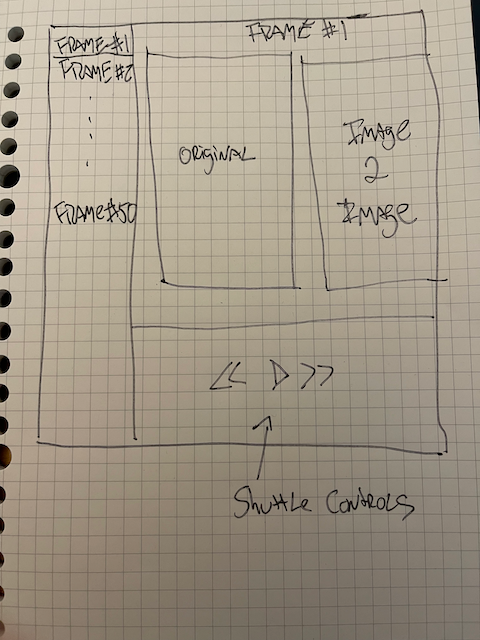

# Pokora
AI Video Editing Platform build using SwiftUI

Pokora is a video editing and creation platform that combines existing video clips with AI generated video clips.

- Loading source clips decomposes them into source frames
- Each frame can be part of an image 2 image AI process based on a text prompt, with a given strength
- The strength can change (in forward or reverse) to go closer to the original or further away
  - this will give the effect of 'fading in' or 'fading out' from AI to the source clip
- AI clips can be generated image 2 image based on the previous frame, rather than a source frame
  - this will create a more 'latent' imagery based solely on the prompt
  - the strength setting here would be different than the source frame image 2 image
- The resulting output can be played back with sound from the original source clip
- Sections be reprocessed without having to reprocess the entire output
- Uprezzing can be done with RealESRGAN to get output larger than 512x512 (and other aspect ratios)
